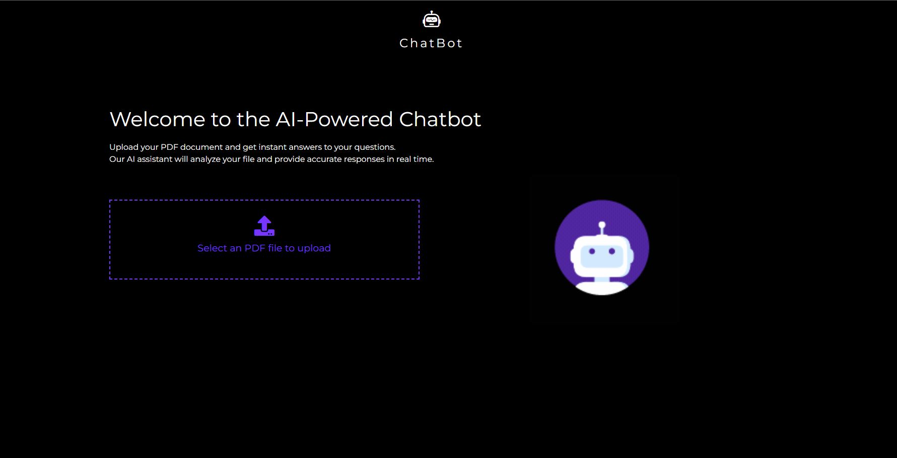
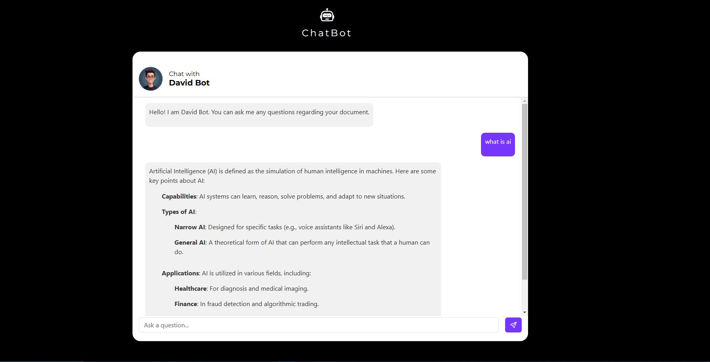

# ChatBot

This repository contains a chatbot built using Flask, LangChain, and Qdrant. The chatbot is designed to answer questions based on the provided content by leveraging Qdrant as a vector database for efficient retrieval-augmented generation (RAG).

## Features
- **Flask Backend:** Lightweight and efficient API for handling user queries.
- **LangChain Integration:** Enables structured retrieval and natural language processing.
- **Qdrant Vector Database:** Stores and retrieves embeddings for semantic search.
- **Contextual Responses:** The chatbot provides answers based on the stored content.

## Installation

1. Clone the repository:
   ```sh
   git clone https://github.com/syeddanishsaleeem/ChatBot.git
   cd ChatBot

2. Create a virtual environment:
   ```sh
   python3 -m venv venv
   source venv/bin/activate  # On Windows use: venv\Scripts\activate

4. Install dependencies:
   ```sh
   pip install -r requirements.txt

5. Set up environment variables:

    Create a .env file in the root directory and add the following content:
    ```sh
    OPEN_API_KEY=your_openai_api_key_here
    
6. Replace your_openai_api_key_here with your actual OpenAI API key.
   Run the Flask application:
   ```sh
    python app.py
   
7. Access the chatbot at:
    ```sh
    http://127.0.0.1:5000

## Docker Setup
To run the chatbot inside a Docker container, follow these steps:

1. Build the Docker image:
   ```sh
   docker build -t flask-chatbot .
   
2. Run the Docker container:
   ```sh
   docker run -d -p 5000:5000  --name=chatbot flask-chatbot
   
3. The chatbot will be accessible at:
   ```sh
   http://127.0.0.1:5000

## Usage
1. Uploading PDF Files:
   . The frontend allows users to upload PDF files.
   . These PDFs are processed, and their content is stored in the Qdrant vector database.
   
2. Asking Questions:

   . Once a document is uploaded, users can ask questions related to its content.
   . The chatbot retrieves the most relevant text segments and generates responses based on them.
   
3. Example Workflow:

   . Upload a PDF file via the frontend.
   . Enter a question in the chat interface.
   . Receive an AI-generated response based on the document’s content.

   
## Preview
   

   


## License
   This project is licensed under the MIT License. See the LICENSE file for details.

## Contact
   For any issues or feature requests, create an issue in the repository or reach out to me at engr.syeddanishsaleem@gmail.com.


   

